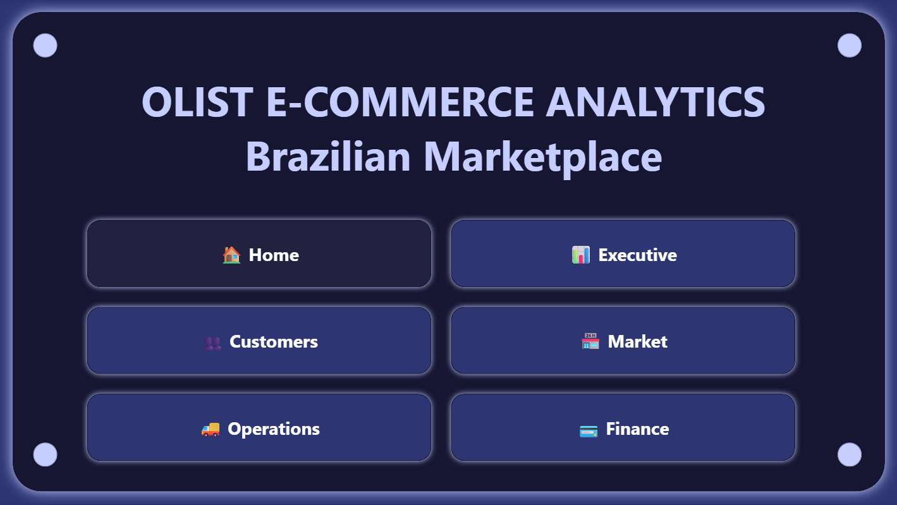
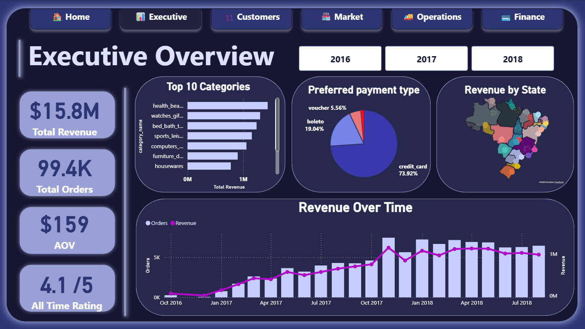
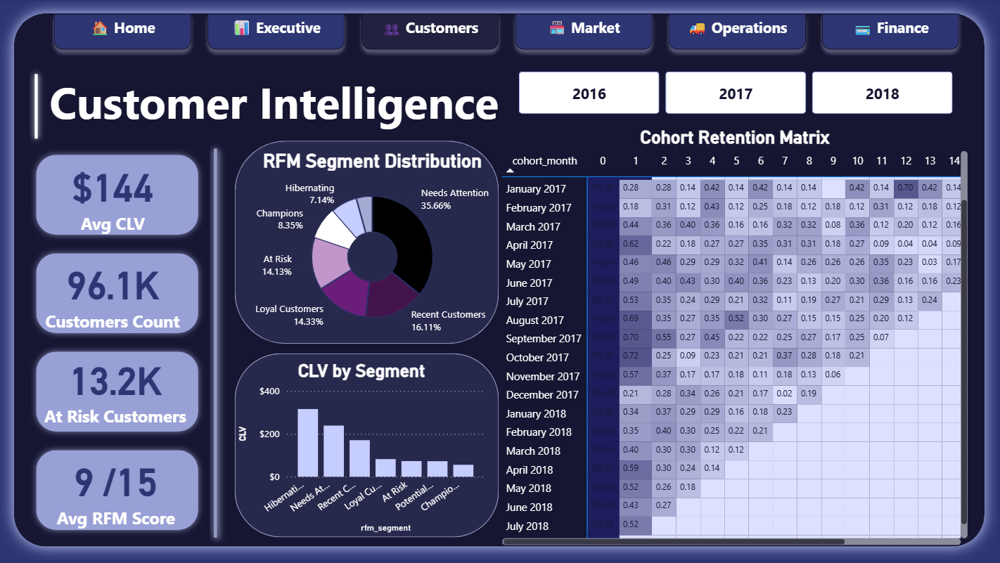
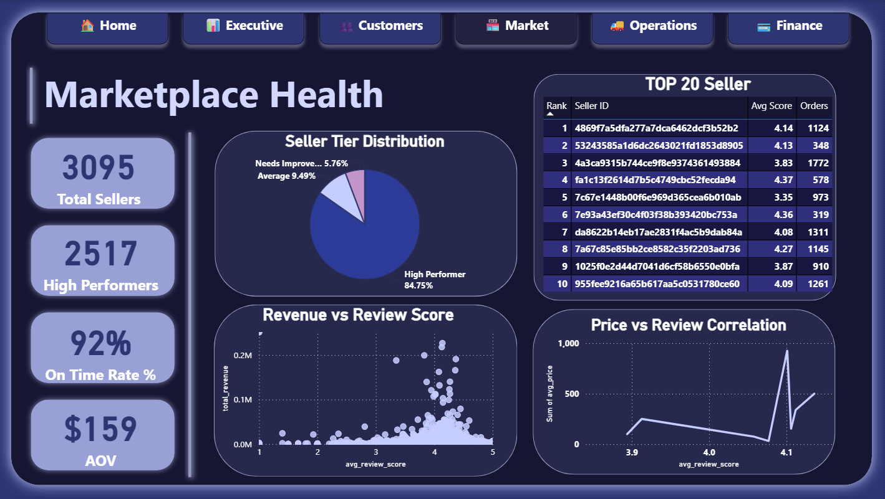
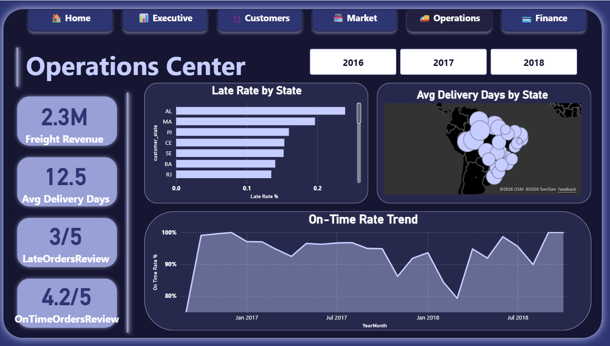
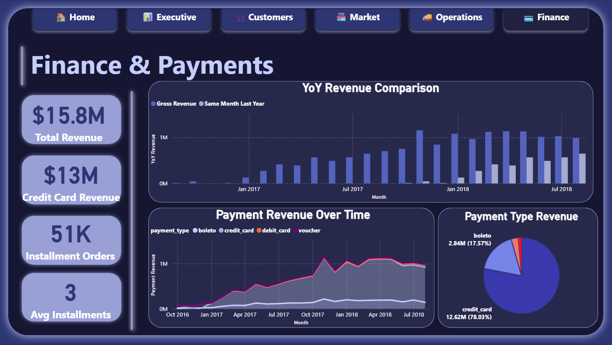

# 🛒 Olist E-Commerce Analytics — End-to-End Data Analysis Project

A full end-to-end data analytics project on the **Brazilian Olist E-Commerce dataset** — covering data cleaning, SQL analytics, customer segmentation, and an interactive 5-dashboard Power BI report.

> **Dataset:** 100,000+ real orders · 8 tables · 2016–2018  
> **Tools:** Python · T-SQL · Power BI · DAX  
> **Schema:** Galaxy Schema (Fact Constellation)

---

## 📸 Dashboard Preview

| Landing Page | Executive Overview |
|---|---|
|  |  |

| Customer Intelligence | Marketplace Health |
|---|---|
|  |  |

| Operations Center | Finance& Payments |
|---|---|
|  |  |

---

## 🎯 Some Business Problems Solved

| # | Business Question | Technique | Key Finding |
|---|---|---|---|
| 1 | Why are customers not returning? | RFM Segmentation, Cohort Analysis | 97% of customers never placed a second order |
| 2 | What drives low review scores? | Delay vs Review Correlation | Late deliveries drop avg score by 1.9 points |
| 3 | Which categories drive revenue? | Pareto Analysis | Top 10 of 73 categories = 80% of revenue |
| 4 | Which sellers need intervention? | Seller Health Scoring | 30% of sellers fall below 70% on-time delivery |
| 5 | How are customers paying? | Payment Method Analysis | 74% of revenue flows through credit card |
| 6 | Which customers are most valuable? | RFM Segmentation · NTILE(5) scoring | Champions segment — under 5% of customers — drives outsized revenue |
| 7 | How do cohorts retain over time? | Monthly Cohort Analysis · Retention Heatmap | Retention drops sharply after month 1 across all cohorts |

---

## 🔍 Project Phases

### Phase 1 — EDA & Data Cleaning `Python`
- Audited all 8 tables for nulls, duplicates, and date logic errors
- Identified and documented the `customer_unique_id` issue (critical for all customer-level analysis)
- Filtered dataset to delivered orders only
- Engineered features for downstream SQL analysis

### Phase 2 — SQL Analytics `T-SQL`
Built **15 analytical views** across 5 business modules

### Phase 3 — Power BI Report `DAX · Power BI`
- **Data model:** Galaxy Schema with 19 active relationships
- **DAX measures:** +20 measures across 5 dashboards
- **Advanced features:** Bookmarks, tooltip pages, field parameters, conditional formatting

---

## 📊 Tools & Technologies

| Tool | Version | Purpose |
|---|---|---|
| Python | 3.10 | EDA, data cleaning, RFM segmentation |
| Pandas | 2.0 | Data manipulation |
| Matplotlib / Seaborn | Latest | EDA visualization |
| SQL Server | 2019 | Data storage and analytical views |
| T-SQL | — | CTEs, window functions, stored procedures |
| Power BI Desktop | Latest | Interactive dashboards |
| DAX | — | +20 analytical measures |

---

## 🤝 Connect

**LinkedIn:** [www.linkedin.com/in/omar-fares10]  
**Email:** [3omar10099@gmail.com]

**Phone:** [+20102648879]

---

*If this project helped you, consider giving it a ⭐ — it helps others find it.*
